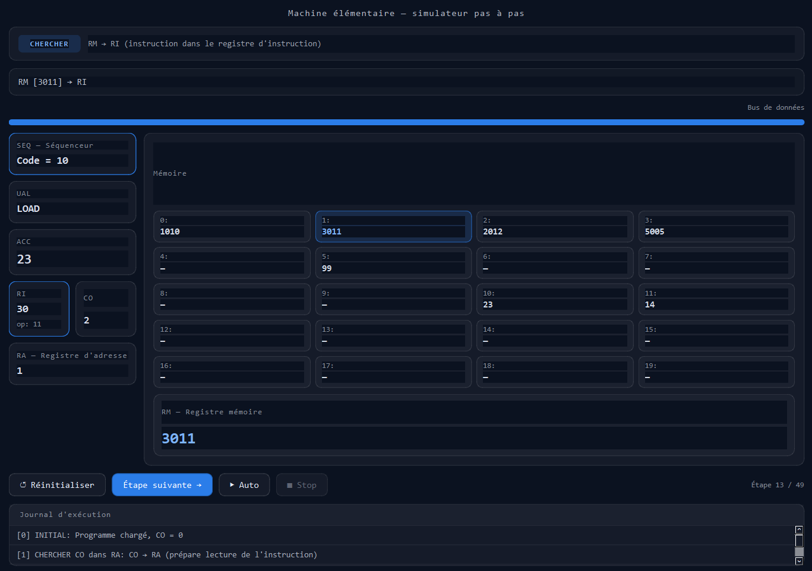
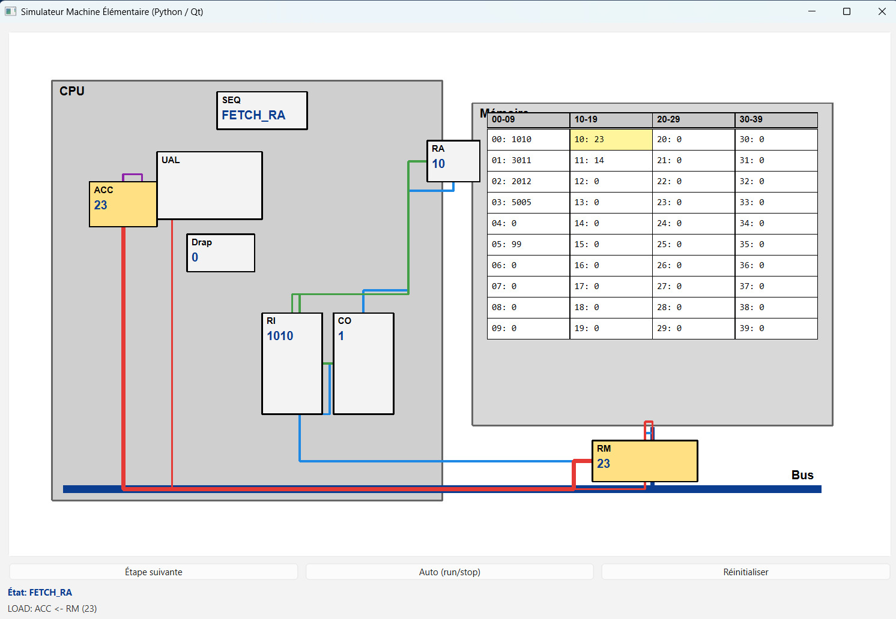
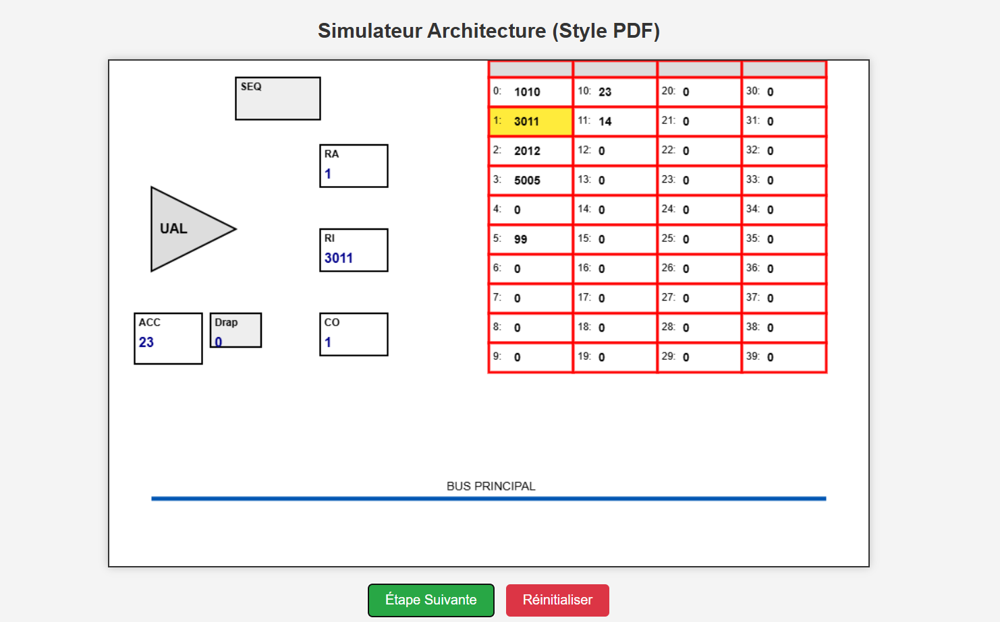
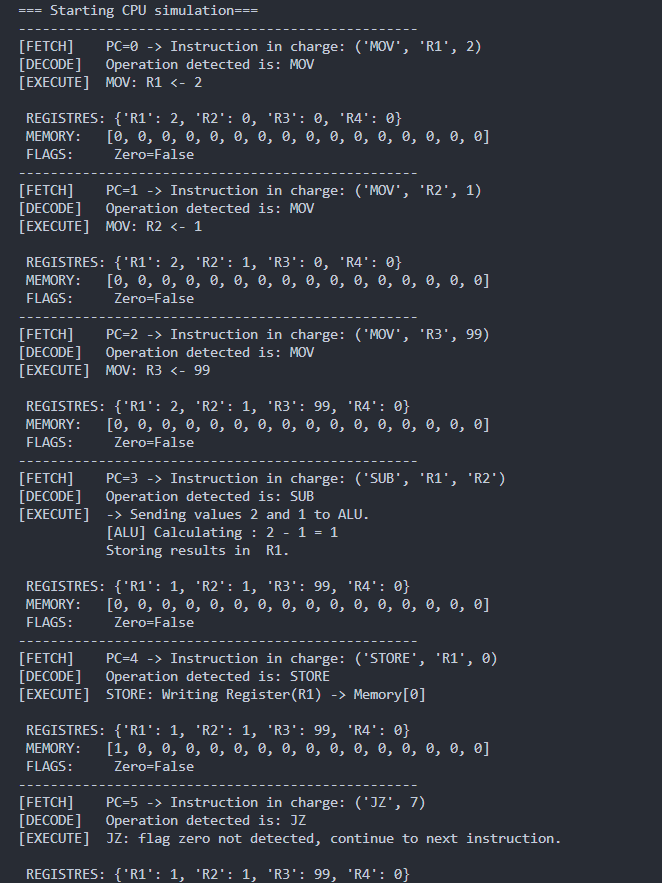

# CPU Architecture Simulation (Educational)

This repository contains multiple small projects that simulate an **elementary CPU architecture** and the **fetch → decode → execute** cycle, with both **visual** and **console** versions.

## Projects in this repo

### 1) `machine_sim_qt.py` — Qt GUI micro-step simulator (blue theme)
A modern UI (PySide6/Qt) that shows CPU execution **step-by-step** with:
- Phase tag: **CHERCHER / DÉCODER / EXÉCUTER**
- Flow description of the current micro-step
- Bus indicator
- CPU blocks (SEQ, UAL, ACC, RI, CO, RA) + RM display
- Memory grid (default view: 0..19)
- Execution log

**Screenshot**


Run:
```bash
pip install PySide6
python machine_sim_qt.py
```

---

### 2) `cpu_visual_sim.py` — PDF-style schematic + bus visualization
A QGraphicsScene/QGraphicsView visualization that draws a schematic similar to course slides:
- CPU panel + memory table
- Big horizontal bus + memory riser
- Routed (orthogonal) arrows to avoid cutting through blocks
- Highlights active transfers (CO→RA, MEM→RM, RM→RI, etc.)

**Screenshot**
> Add an image at: `docs/cpu_visual_sim.png`



Run:
```bash
pip install PySide6
python cpu_visual_sim.py
```

---

### 3) `Qwen_html_20260425_1zdw71sdp.html` — HTML Canvas prototype
An earlier HTML/Canvas version used as a reference for the visual style and transfers.

**Screenshot**
> Add an image at: `docs/html_canvas.png`



Run: open the file in your browser:
- double click it locally, or
- use VS Code “Live Server”, etc.

---

### 4) `simpleCPU.py` — Console CPU (register machine)
A text-based CPU simulator demonstrating:
- Registers: R1..R4
- Memory (16 cells)
- PC, IR, ALU temp register
- Zero flag + control flow (JMP, JZ)
- Prints fetch/decode/execute logs and state after each instruction

**Screenshot**
> Add an image at: `docs/simpleCPU_terminal.png`



Run:
```bash
python simpleCPU.py
```

---

## Instruction formats

### Elementary machine (visual simulators)
Instructions are 4-digit numbers:
- `opcode = instr // 100`
- `operand = instr % 100`

Supported opcodes:
- `10` LOAD: `ACC ← MEM[operand]`
- `20` STORE: `MEM[operand] ← ACC`
- `30` ADD: `ACC ← ACC + MEM[operand]`
- `50` JUMP: `CO ← operand`
- `99` HALT

### Console CPU (`simpleCPU.py`)
Instruction tuples like:
- `("MOV","R1",2)`
- `("SUB","R1","R2")`
- `("STORE","R1",0)`
- `("JZ", 7)`
- `("HALT",)`

---

## Requirements
- Python 3.9+
- For GUI versions: `PySide6`

Install:
```bash
pip install PySide6
```

---

## Troubleshooting

### `ModuleNotFoundError: No module named 'PySide6'`
PySide6 is installed in a different environment than the interpreter you are running.

Fix:
```bash
python -m pip install PySide6
python -c "import PySide6; print(PySide6.__version__)"
```

In VS Code: **Python: Select Interpreter** and choose the environment where PySide6 is installed.

---

## Add your screenshots
Create these files in the repo so the images above render:

- `docs/machine_sim_qt.png`
- `docs/cpu_visual_sim.png`
- `docs/html_canvas.png`
- `docs/simpleCPU_terminal.png`
